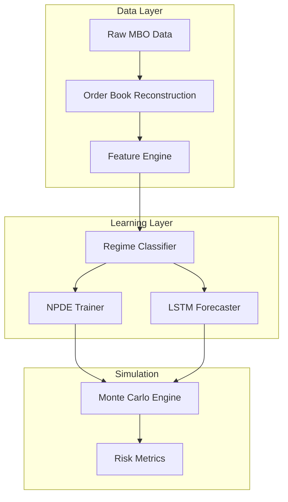

Here’s a refined README that frames the project as a research repository with a stronger thesis orientation, while accurately reflecting the current development stage:

---

# Market Microstructure Regime Dynamics & Tail Risk Modeling

*A research framework for learning market regimes from microstructure signals and simulating regime-adaptive tail risks using Neural PDEs*

## Research Thesis

Financial markets exhibit nonlinear phase transitions between distinct **microstructure regimes** (e.g., liquid, volatile, crisis). Traditional risk models fail to capture these dynamics because they:

1. **Ignore regime-dependent mechanics** (e.g., liquidity withdrawal during crises alters price diffusion).  
2. **Underestimate cross-asset propagation** (e.g., futures → spot contagion).  
3. **Use static distributions** that don’t adapt to latent market states.  

This project proposes:  
- **Regimes as learnable latent states** that govern market dynamics.  
- **Neural Partial Differential Equations (NPDEs)** to model regime-specific price formation.  
- **Microstructure-aware simulations** for more accurate VaR/CVaR.  


## Current Development Status

| Component               | Status                          | Next Steps                     |
|-------------------------|---------------------------------|--------------------------------|
| Feature Engineering     | Redesign in progress            | MI/PCA for feature selection  |
| Regime Classification   | Testing HMM/GHMM/HSMM variants  | Interpretability validation    |
| NPDE/LSTM Framework     | Research phase                  | Prototype per-regime NPDEs     |
| Propagation Models      | Design phase                    | Granger causality baseline     |

## Methodology

### 1. Feature Space Construction *(Active Redesign)*
- **Inputs**: Order book events (MBO), trades, derived signals  
- **Selection Criteria**:  
  - Mutual Information with regime labels  
  - Nonlinear redundancy (t-SNE clustering)  
- **Key Features**:  
  - *Directional volatility*  
  - *LOB slope* (liquidity gradient)  
  - *Order Flow Imbalance (OFI)*  
  - *Vol-of-vol* (higher-order dynamics)  

### 2. Regime Learning *(Testing Phase)*
- **Models**:  
  - **HMM**: Baseline Markov transitions  
  - **HSMM**: Duration-aware regimes  
  - **GMM-tSNE**: Nonparametric alternative  
- **Validation**:  
  - Silhouette score ≥ 0.6  
  - Crisis regime recall > 90%  

### 3. Neural PDE Dynamics *(Future Work)*
- **Per-Regime NPDEs**:  
  ```math
  \frac{\partial S_t}{\partial t} = f_\theta^{s_t}(S_t, \nabla \text{LOB}_t, \text{OFI}_t)
  ```
- **Cross-Asset Coupling**:  
  Forcing terms $g_\phi(S^B_t, s^B_t)$ model lead-lag effects.  

### 4. Simulation Pipeline
1. Classify regime $s_t$ from normalized features  
2. Query regime-specific NPDE + LSTM feature forecaster  
3. Step simulation:  
   ```python
   dS_t = NPDE(s_t)(S_t, raw_features) + λ·g_ϕ(S^B_t)
   S_{t+1} = S_t + dS_t + σ_t dW_t
   ```
4. Compute VaR/CVaR from joint paths  

## System Architecture



## Key Innovations

1. **Regime-Dependent Mechanics**  
   - NPDEs learn distinct drift/diffusion laws per regime.  
   - Captures liquidity-driven nonlinearities.  

2. **Provable Stability**  
   - Lyapunov constraints on NPDE solutions.  
   - Adjoint methods for gradient control.  

3. **Microstructure-Conscious Risk**  
   - Simulated LOB dynamics feed back into price paths.  
   - No "fixed correlation" assumptions.  

## Getting Started

### Dependencies
- **C++20**: For high-performance core  
- **CUDA**: NPDE solving (future)  
- **Python**: Analysis/visualization  
- Visit module readmes for external dependencies

### Development Phases
1. **Feature Redesign** (`feature_engineering/`)  
   - Run MI/PCA analysis:  
   ```bash
   python -m feature_engineering.select --input ./data/lob_features.parquet
   ```
2. **Regime Testing** (`regime_classifier/`)  
   - Validate HMM variants with Silhouette Score, and Regime Separation:  
   ```bash
   python -m regime_classifier.train --model hsmm --data ./data/normalized.parquet
   ```
3. **NPDE Prototyping** *(Future)*  
   - See `prototypes/npde_exploration.ipynb`

## License
MIT (Open Academic Use Encouraged)