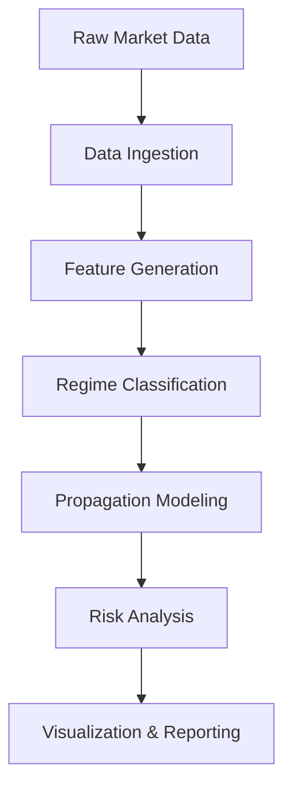
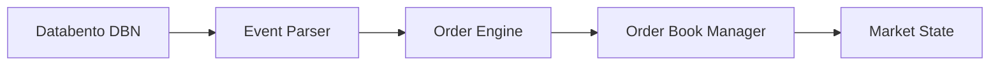
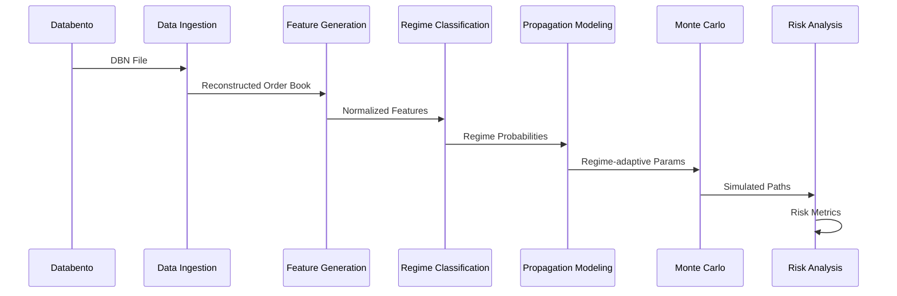
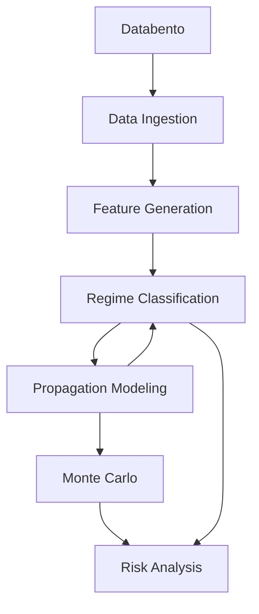

# Market Microstructure Regime Analysis System

A high-performance C++ system for analyzing market microstructure regimes, modeling their propagation between assets, and performing risk analysis using Monte Carlo simulations.

## Project Overview

This system is designed to analyze the market microstructure of various assets and detect regimes characterized by distinct market microstructure conditions. The primary goals of this project are to:
1. Reconstruct order books from high-frequency market data
2. Extract meaningful features from the order book that capture the underlying market microstructure conditions
3. Use machine learning techniques to classify the market regimes based on the extracted features
4. Model the propagation of regimes between related assets, enabling the prediction of regime transitions in other assets
5. Perform regime-adaptive risk analysis using Monte Carlo simulations, providing a more accurate and robust assessment of potential risks and opportunities in the markets.

The main theories behind this system are: 
1. Market microstructure regimes are predictable and have fairly consistent patterns. 
2. Micro-regimes between an fast-moving asset and a slow-moving asset that have a semantic relationship, like a future and its spot, are related, and the fast-moving asset can be used to predict the slow-moving asset.
3. Combining these two ideas leads us to the idea that we can use fast-moving asset regimes to assist in predicting slow regimes, and use those regime predictions to model risk better through better parameterized Monte Carlo simulations.



## System Architecture

### 1. Data Ingestion Module
- Processes Databento MBO (Market-By-Order) historical data
- Reconstructs limit order books for each instrument
- Handles market events (add, modify, cancel, trade, fill)



### 2. Feature Generation Module
- Computes order book features
- Normalizes features across different time windows
- Handles feature engineering for regime classification


### 3. Regime Classification Module
- Implements HMM and/or other ML models
- Classifies market regimes in real-time
- Provides regime probabilities and confidence scores

### 4. Propagation Modeling
- Analyzes lead-lag relationships between assets
- Models regime transitions and propagation
- Implements Granger causality tests

### 5. Monte Carlo Engine (CUDA)
- Parallel simulation of market scenarios
- Regime-adaptive simulation parameters
- High-performance computation using CUDA

### 6. Risk Analysis
- Computes Value-at-Risk (VaR) and Expected Shortfall
- Regime-conditional risk metrics
- Stress testing and scenario analysis

## Key Features

- **High Performance**: Optimized C++ implementation for low-latency processing
- **Modular Design**: Independent components with clean interfaces
- **Extensible**: Easy to add new features and models
- **Scalable**: Handles high-frequency data with low latency
- **Reproducible**: Deterministic order book reconstruction

## Getting Started

### Prerequisites

- C++20 compatible compiler
- CUDA Toolkit (for Monte Carlo simulations)
- CMake 3.15+
- Conan package manager
- Python 3.8+ (for analysis scripts)

### Building the Project

#### Cloning databento-cpp

Clone the [databento-cpp](https://github.com/databento/databento-cpp) repository and add it as a submodule to your project.

#### Installing dependencies

Install the following dependencies using [vcpkg](https://github.com/microsoft/vcpkg) or by placing them adjacent to your project:

- [OpenSSL](https://www.openssl.org/) (minimum version 3.0)
- [Libcrypto](https://www.openssl.org/docs/man1.1.1/man3/crypto.html)
- [Zstandard (zstd)](https://github.com/facebook/zstd)
- [nlohmann_json](https://github.com/nlohmann/json) (header-only)
- [cpp-httplib](https://github.com/yhirose/cpp-httplib) (header-only)
- [date](https://github.com/HowardHinnant/date) (header-only)

Make sure to add the following directories to your `CMAKE_PREFIX_PATH`:

- `vcpkg/installed/x64-windows`
- `databento-cpp/deps`

```bash
mkdir build && cd build
cmake -DCMAKE_BUILD_TYPE=Release .. -DCMAKE_TOOLCHAIN_FILE="path/to/vcpkg/scripts/buildsystems/vcpkg.cmake"
cmake --build . --config Release
```

## Project Structure

```
MicroRegimeProject/
├── data_ingestion/      # Module 1: Market data processing
├── feature_generation/  # Module 2: Feature extraction
├── regime_classifier/   # Module 3: Regime classification
├── propagation_model/   # Module 4: Regime propagation
├── monte_carlo/         # Module 5: CUDA simulations
├── risk_analysis/       # Module 6: Risk metrics
└── validation/          # Module 7: Verification & benchmarking
```

## Performance Considerations

- **Memory Efficiency**: Custom allocators for high-frequency data
- **Parallel Processing**: Multi-threading and GPU acceleration
- **Cache Optimization**: Data-oriented design for better cache utilization
- **Zero-copy**: Minimizing data movement between components

## Contributing

1. Fork the repository
2. Create a feature branch
3. Commit your changes
4. Push to the branch
5. Create a Pull Request

## License

MIT License

## Contact

Email: jackdamato05@gmail.com

Github: https://github.com/jackdamato05

LinkedIn: https://www.linkedin.com/in/jack-damato/

## Key Diagrams

### Data Flow



### Module Dependencies

