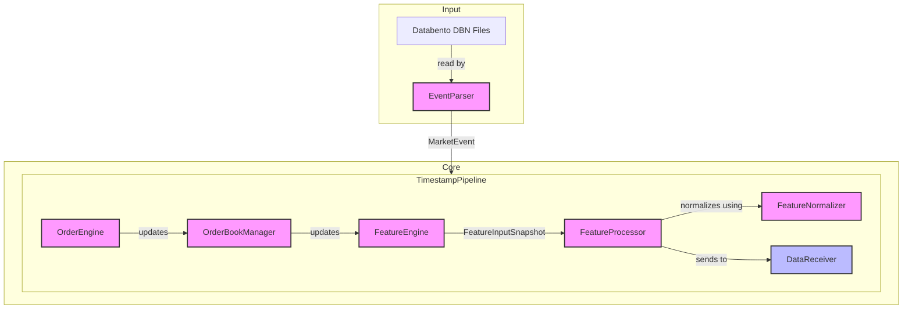
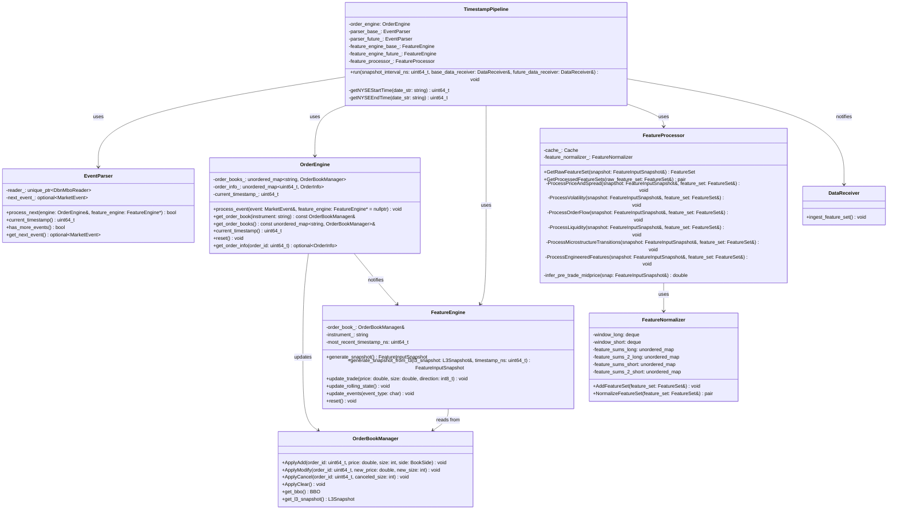
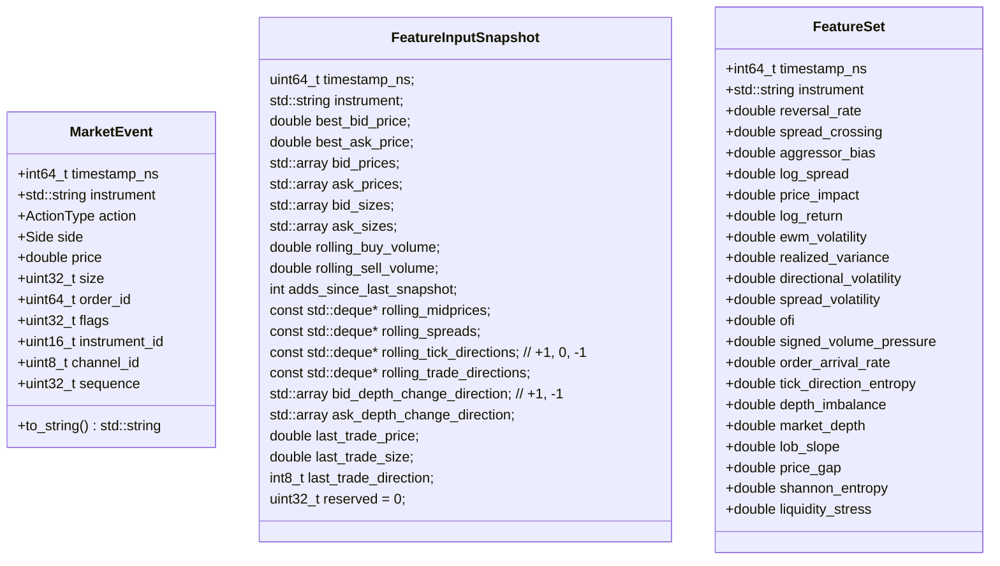
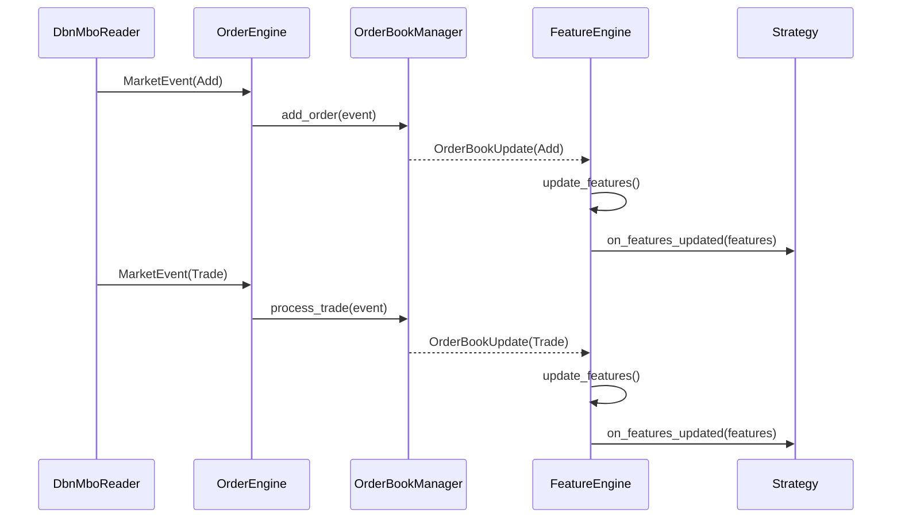
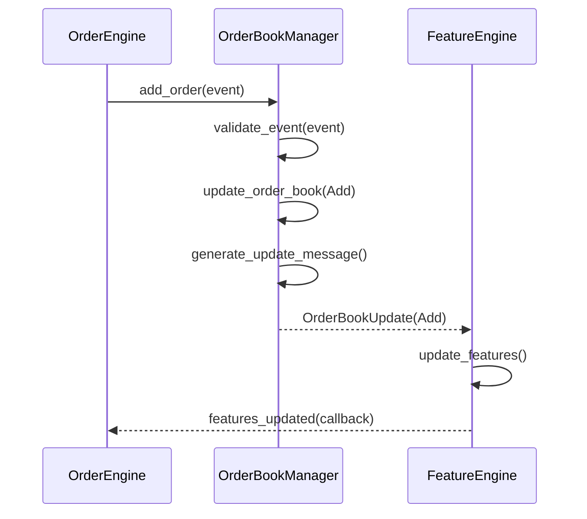
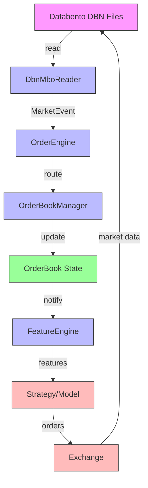
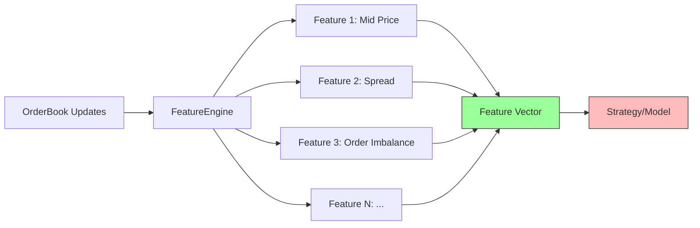
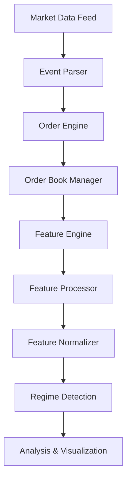
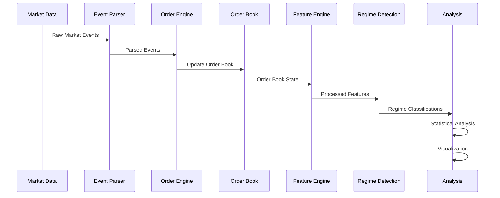

# MicroRegime Project Architecture



## Component Overview

## Overview
This document provides a comprehensive overview of the MicroRegime project's architecture, including its components, their relationships, and data flow.

## Core Components

## Class Diagrams

### 1. Core Classes
DBNReader, EventParser, OrderBookManager, OrderEngine, FeatureEngine, FeatureProcessor, FeatureNormalizer, TimestampPipeline, DataReciever

TimestampPipeline holds EventParser, OrderBookManager, OrderEngine, FeatureEngine, FeatureProcessor, FeatureNormalizer, DataReciever For both assets

Event Parser holds DBN Reader, parses and outputs Market Events
OrderEngine holds and OrderBookManager per instrument, is passed a FeatureEngine and MarketEvent to ProcessEvents from Event Parser. Handles calling the right functions in the OrderBookManager and updating the FeatureEngine in the right way
FeatureEngine does not hold anything other than state data about the market, can call generate_snapshot to recieve a FeatureInputSnapshot Data Transfer Object.

FeatureProcessor has a FeatureNormalizer and a Cache. It will take a FeatureInputSnapshot DTO and generate a raw FeatureSet, as well as Normalized FeatureSet's using long and short Welfords Online Windows (with the feature_normalizer_ member variable)

FeatureNormalizer has a long and short Welfords Online Window for each feature. It will take a FeatureSet and normalize it using the long and short Welfords Online Windows (with the feature_normalizer_ member variable)

Timestamp pipeline interface: pass in a date and two asset names and a data reciever. The data reciever will be called with the normalized feature sets for the two assets



### 2. Data Transfer Objects



## Sequence Diagrams

### 1. Market Data Processing Flow



### 2. Order Book Update Flow



## Data Flow Diagrams

### 1. System-Level Data Flow



### 2. Feature Computation Flow



## Component Details

### 1. Market Data Layer

#### DbnMboReader (`dbn_reader.hpp/cpp`)
- **Purpose**: Reads and parses market-by-order (MBO) data from Databento files
- **Key Features**:
  - Reads MBO records and converts them to `MarketEvent` objects
  - Supports sequential reading of market data
  - Tracks instrument-specific data

#### MarketEvent (`market_event.hpp`)
- **Data Structure**: Represents a single market event
- **Fields**:
  - `timestamp_ns`: Nanosecond timestamp
  - `instrument`: Instrument identifier (e.g., "ES")
  - `action`: Type of event (Add/Modify/Cancel/Trade/Fill/Replace)
  - `side`: Bid/Ask/None
  - `price`: Price level
  - `size`: Order size
  - `order_id`: Unique order identifier
  - `flags`: Bitfield for additional metadata
  - `instrument_id`: Numeric instrument identifier
  - `channel_id`: Feed channel identifier
  - `sequence`: Sequence number for gap detection

### 2. Order Book Management

#### OrderBookManager (`order_book.hpp/cpp`)
- **Purpose**: Maintains the limit order book state
- **Key Features**:
  - Tracks price levels and order queues
  - Handles order add/modify/cancel operations
  - Maintains L3 views of the order book
  - Provides snapshots and deltas of the order book state

#### Data Structures:
- `PriceLevel`: Price and size at a specific level
- `L3Snapshot`: Snapshot of top N price levels for both sides
- `L3Delta`: Changes to the order book since last update
- `Order`: Represents an individual order in the book
- `OrderRef`: Reference to an order's location in the book

### 3. Feature Engineering

#### FeatureEngine (`feature_engine.hpp/cpp`)
- **Purpose**: Computes features from order book state
- **Key Features**:
  - Generates feature snapshots from order book state
  - Maintains rolling windows for time-series features
  - Supports both real-time and batch processing
  - Handles trade and quote updates

#### Feature Types:
- Price-based features (mid-price, spread, etc.)
- Volume-based features
- Order flow metrics
- Statistical measures (volatility, skew, etc.)

### 4. Order Processing

#### OrderEngine (`order_engine.hpp/cpp`)
- **Purpose**: Processes market events and maintains order state
- **Key Features**:
  - Routes events to the appropriate order book
  - Maintains order metadata
  - Handles instrument-specific order books
  - Integrates with FeatureEngine for feature generation

## Data Flow

1. **Data Ingestion**:
   - `DbnMboReader` reads raw market data and produces `MarketEvent` objects

2. **Event Processing**:
   - `OrderEngine` receives `MarketEvent` objects
   - Events are routed to the appropriate `OrderBookManager`
   - Order book state is updated based on the event type

3. **Feature Generation**:
   - `FeatureEngine` observes order book state
   - Features are computed and made available for consumption
   - Features can be used for strategy signals or model training

4. **Output**:
   - Feature snapshots
   - Order book state
   - Processed market data


## Configuration

### Common Constants (`common_constants.hpp`)
- Defines system-wide constants
- Includes:
  - Default order book depth levels
  - Price and size precision
  - System limits

# MicroRegime Project Architecture

## System Overview



## Core Components

### 1. Event Parser
- **Purpose**: Parse incoming market data feed (DBN format)
- **Key Features**:
  - Handles multiple instruments
  - Buffers events for lookahead
  - Validates and normalizes market data

### 2. Order Engine
- **Purpose**: Process market events and maintain order book state
- **Key Features**:
  - Handles order adds, modifies, and cancels
  - Maintains order metadata
  - Tracks order lifecycle

### 3. Order Book Manager
- **Purpose**: Maintain limit order book state
- **Data Structures**:
  - Bid/Ask books using ordered maps
  - Order lookup table
  - Snapshot and delta tracking

### 4. Feature Engine
- **Purpose**: Calculate market microstructure features
- **Features Calculated**:
  - Price and spread metrics
  - Volume and order flow indicators
  - Liquidity measures
  - Volatility estimates

### 5. Feature Processor
- **Purpose**: Process and normalize features
- **Components**:
  - Raw feature calculation
  - Normalization (z-score, min-max)
  - Feature selection

### 6. Regime Detection
- **Purpose**: Identify market regimes using HMM
- **Implementation**:
  - Variational Gaussian HMM
  - Multiple observation models
  - Regime classification

## Data Flow



## Python Analysis Components

### 1. Regime Analysis (`regime_data_analysis.py`)
- Loads and analyzes regime-classified data
- Generates descriptive statistics for each regime
- Handles missing data and normalization

### 2. HMM Implementation (`ghmm_tester.py`)
- Implements Variational Gaussian HMM
- Handles feature preprocessing (PCA, scaling)
- Trains and evaluates regime models

### 3. Visualization (`graphing.py`, `highlighted_graph.py`)
- Generates time series plots
- Visualizes regime transitions
- Compares feature distributions across regimes

## Performance Considerations

### Memory Efficiency
- Uses fixed-size arrays for price levels
- Implements custom memory management
- Minimizes allocations in hot paths

### Processing Speed
- Optimized for low-latency processing
- Batch processing capabilities
- Efficient data structures for order lookup

## Extensibility

The architecture is designed to be extended with:
- Additional data sources and protocols
- New feature calculations
- Alternative regime detection algorithms
- Real-time monitoring and alerts
- Backtesting framework

## Dependencies

### Core Dependencies
- C++17 or later
- Python 3.8+
- Standard Library
- Databento DBN decoder
- hmmlearn
- pandas
- numpy
- scikit-learn
- matplotlib

## Build and Integration

### C++ Components
```bash
mkdir -p build && cd build
cmake ..
make -j$(nproc)
```

### Python Environment
```bash
python -m venv venv
source venv/bin/activate  # On Windows: venv\Scripts\activate
pip install -r requirements.txt
```

## Data Pipeline

1. **Data Ingestion**:
   - Raw market data in DBN format
   - Multiple instruments (e.g., SPY, ES)
   - High-frequency order book updates

2. **Feature Processing**:
   - Real-time feature calculation
   - Normalization and scaling
   - Dimensionality reduction (PCA)

3. **Regime Analysis**:
   - HMM-based regime detection
   - Statistical analysis of regimes
   - Visualization and reporting

## Future Work

- Implement online learning for regime detection
- Add more sophisticated feature engineering
- Integrate with trading strategies
- Develop real-time monitoring dashboard
