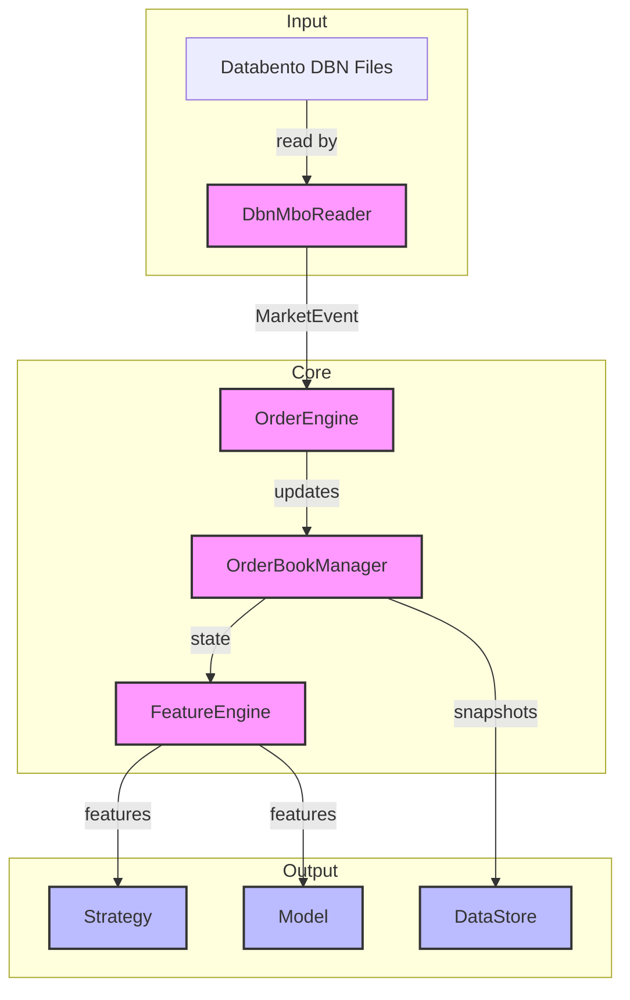
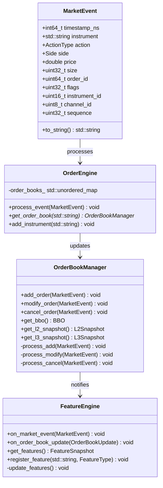
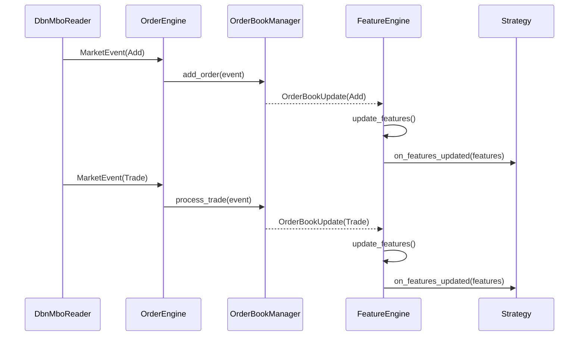
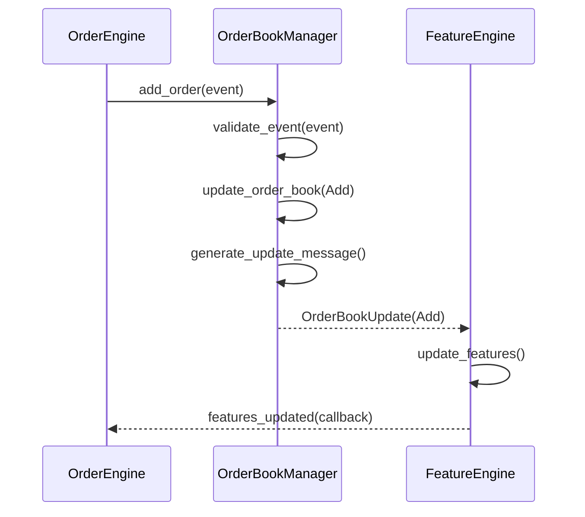
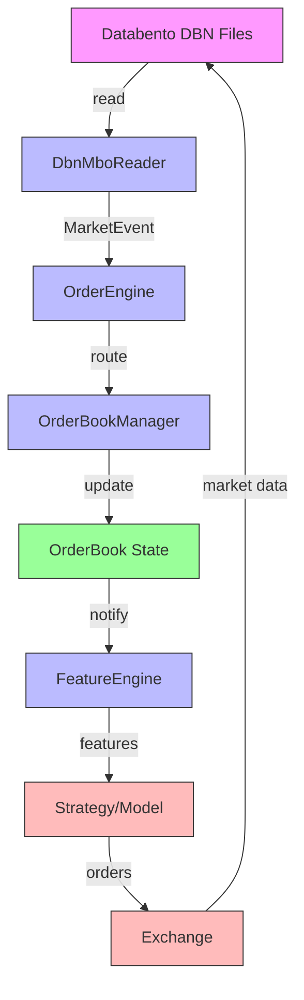
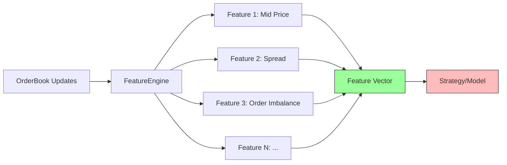

# MicroRegime Project Architecture



## Component Overview

## Overview
This document provides a comprehensive overview of the MicroRegime project's architecture, including its components, their relationships, and data flow.

## Core Components

## Class Diagrams

### 1. Core Classes



### 2. Data Structures

```mermaid
classDiagram
    class L2Snapshot {
        +int64_t timestamp_ns
        +std::string instrument
        +std::vector<PriceLevel> bids
        +std::vector<PriceLevel> asks
        +to_json() std::string
    }
    
    class L3Snapshot {
        +int64_t timestamp_ns
        +std::string instrument
        +std::map<Price, std::vector<Order>> bids
        +std::map<Price, std::vector<Order>> asks
        +to_json() std::string
    }
    
    class FeatureSnapshot {
        +int64_t timestamp_ns
        +std::string instrument
        +std::unordered_map<std::string, double> features
        +add_feature(std::string, double) void
        +get_feature(std::string) double
        +to_json() std::string
    }
    
    class OrderBookUpdate {
        +enum class Type { Add, Modify, Cancel, Trade }
        +Type type
        +MarketEvent event
        +L2Snapshot snapshot
        +std::vector<L2Delta> deltas
    }
```

## Sequence Diagrams

### 1. Market Data Processing Flow



### 2. Order Book Update Flow



## Data Flow Diagrams

### 1. System-Level Data Flow



### 2. Feature Computation Flow



## Component Details

### 1. Market Data Layer

#### DbnMboReader (`dbn_reader.hpp/cpp`)
- **Purpose**: Reads and parses market-by-order (MBO) data from Databento files
- **Key Features**:
  - Reads MBO records and converts them to `MarketEvent` objects
  - Supports sequential reading of market data
  - Tracks instrument-specific data

#### MarketEvent (`market_event.hpp`)
- **Data Structure**: Represents a single market event
- **Fields**:
  - `timestamp_ns`: Nanosecond timestamp
  - `instrument`: Instrument identifier (e.g., "ES")
  - `action`: Type of event (Add/Modify/Cancel/Trade/Fill/Replace)
  - `side`: Bid/Ask/None
  - `price`: Price level
  - `size`: Order size
  - `order_id`: Unique order identifier
  - `flags`: Bitfield for additional metadata
  - `instrument_id`: Numeric instrument identifier
  - `channel_id`: Feed channel identifier
  - `sequence`: Sequence number for gap detection

### 2. Order Book Management

#### OrderBookManager (`order_book.hpp/cpp`)
- **Purpose**: Maintains the limit order book state
- **Key Features**:
  - Tracks price levels and order queues
  - Handles order add/modify/cancel operations
  - Maintains both L2 and L3 views of the order book
  - Provides snapshots and deltas of the order book state

#### Data Structures:
- `PriceLevel`: Price and size at a specific level
- `L3Snapshot`: Snapshot of top N price levels for both sides
- `L3Delta`: Changes to the order book since last update
- `Order`: Represents an individual order in the book
- `OrderRef`: Reference to an order's location in the book

### 3. Feature Engineering

#### FeatureEngine (`feature_engine.hpp/cpp`)
- **Purpose**: Computes features from order book state
- **Key Features**:
  - Generates feature snapshots from order book state
  - Maintains rolling windows for time-series features
  - Supports both real-time and batch processing
  - Handles trade and quote updates

#### Feature Types:
- Price-based features (mid-price, spread, etc.)
- Volume-based features
- Order flow metrics
- Statistical measures (volatility, skew, etc.)

### 4. Order Processing

#### OrderEngine (`order_engine.hpp/cpp`)
- **Purpose**: Processes market events and maintains order state
- **Key Features**:
  - Routes events to the appropriate order book
  - Maintains order metadata
  - Handles instrument-specific order books
  - Integrates with FeatureEngine for feature generation

## Data Flow

1. **Data Ingestion**:
   - `DbnMboReader` reads raw market data and produces `MarketEvent` objects

2. **Event Processing**:
   - `OrderEngine` receives `MarketEvent` objects
   - Events are routed to the appropriate `OrderBookManager`
   - Order book state is updated based on the event type

3. **Feature Generation**:
   - `FeatureEngine` observes order book state
   - Features are computed and made available for consumption
   - Features can be used for strategy signals or model training

4. **Output**:
   - Feature snapshots
   - Order book state
   - Processed market data


## Configuration

### Common Constants (`common_constants.hpp`)
- Defines system-wide constants
- Includes:
  - Default order book depth levels
  - Price and size precision
  - System limits

## Performance Considerations

- **Memory Efficiency**:
  - Uses fixed-size arrays for price levels
  - Implements custom memory management
  - Minimizes allocations in hot paths

- **Processing Speed**:
  - Optimized for low-latency processing
  - Batch processing capabilities
  - Efficient data structures for order lookup

## Extensibility

The architecture is designed to be extended with:
- Additional data sources
- New feature calculations
- Alternative order matching logic
- Different market data protocols

## Dependencies

- C++17 or later
- Standard Library
- Databento DBN decoder
- (Add other dependencies as needed)

## Build and Integration

(Add build system and integration details here)
