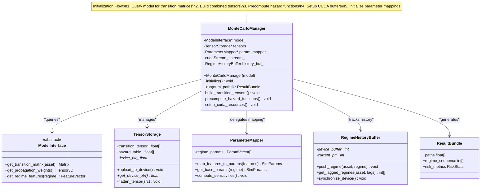
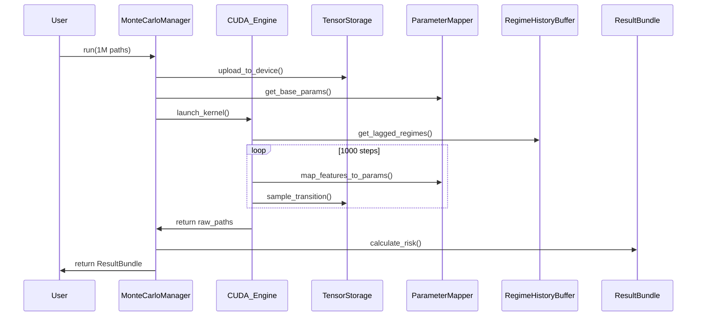

```mermaid
classDiagram
    class MonteCarloManager {
        -ModelInterface* model_
        -TensorStorage* tensors_
        -ParameterMapper* param_mapper_
        -cudaStream_t stream_
        -RegimeHistoryBuffer history_buf_
        
        +MonteCarloManager(model)
        +initialize() void
        +run(num_paths) ResultBundle
        -build_transition_tensors() void
        -precompute_hazard_functions() void
        -setup_cuda_resources() void
    }

    class ModelInterface {
        <<abstract>>
        +get_transition_matrix(asset) Matrix
        +get_propagation_weights() Tensor3D
        +get_regime_features(regime) FeatureVector
    }

    class TensorStorage {
        -transition_tensor_ float[]
        -hazard_table_ float[]
        -device_ptr_ float*
        
        +upload_to_device() void
        +get_device_ptr() float*
        -flatten_tensor(src) void
    }

    class ParameterMapper {
        -regime_params_ ParamVector[]
        
        +map_features_to_params(features) SimParams
        +get_base_params(regime) SimParams
        +compute_sensitivities() void
    }

    class RegimeHistoryBuffer {
        -device_buffer_ int*
        -current_ptr_ int*
        
        +push_regime(asset, regime) void
        +get_lagged_regimes(asset, lags) int[]
        +synchronize_device() void
    }

    class ResultBundle {
        +paths float[]
        +regime_sequence int[]
        +risk_metrics RiskStats
    }

    MonteCarloManager --> ModelInterface : "queries"
    MonteCarloManager --> TensorStorage : "manages"
    MonteCarloManager --> ParameterMapper : "delegates mapping"
    MonteCarloManager --> RegimeHistoryBuffer : "tracks history"
    MonteCarloManager --> ResultBundle : "generates"
    
    note for MonteCarloManager "Initialization Flow:\n1. Query model for transition matrices\n2. Build combined tensors\n3. Precompute hazard functions\n4. Setup CUDA buffers\n5. Initialize parameter mappings"
```

```mermaid
sequenceDiagram
    participant User
    participant MonteCarloManager
    participant CUDA_Engine
    
    User->>MonteCarloManager: run(1M paths)
    MonteCarloManager->>TensorStorage: upload_to_device()
    MonteCarloManager->>ParameterMapper: get_base_params()
    MonteCarloManager->>CUDA_Engine: launch_kernel()
    CUDA_Engine->>RegimeHistoryBuffer: get_lagged_regimes()
    loop 1000 steps
        CUDA_Engine->>ParameterMapper: map_features_to_params()
        CUDA_Engine->>TensorStorage: sample_transition()
    end
    CUDA_Engine->>MonteCarloManager: return raw_paths
    MonteCarloManager->>ResultBundle: calculate_risk()
    MonteCarloManager->>User: return ResultBundle
```
